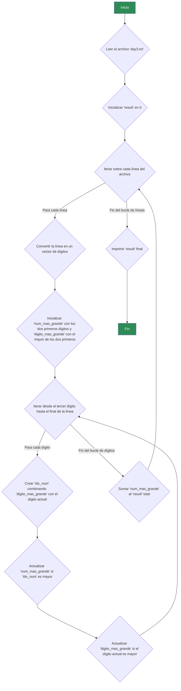

```mermaid
graph TD
    A[Inicio] --> B{Leer el archivo 'day3.txt'};
    B --> C{Inicializar 'result' en 0};
    C --> D{Iterar sobre cada línea del archivo};
    D -- Para cada línea --> E{Convertir la línea en un vector de dígitos};
    E --> F{Inicializar 'num_mas_grande' con los dos primeros dígitos y 'digito_mas_grande' con el mayor de los dos primeros};
    F --> G{Iterar desde el tercer dígito hasta el final de la línea};
    G -- Para cada dígito --> H{Crear 'idx_num' combinando 'digito_mas_grande' con el dígito actual};
    H --> I{Actualizar 'num_mas_grande' si 'idx_num' es mayor};
    I --> J{Actualizar 'digito_mas_grande' si el dígito actual es mayor};
    J --> G;
    G -- Fin del bucle de dígitos --> K{Sumar 'num_mas_grande' al 'result' total};
    K --> D;
    D -- Fin del bucle de líneas --> L{Imprimir 'result' final};
    L --> M[Fin];

    style A fill:#2E8B57,color:#fff
    style M fill:#2E8B57,color:#fff
```
